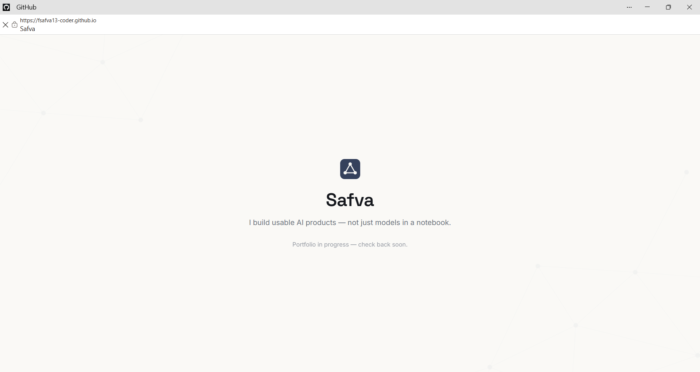
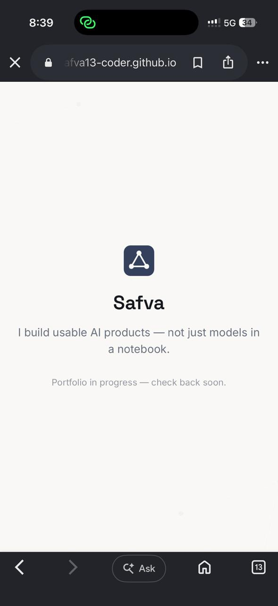

# safva-portfolio

**A portfolio built to prove one thing: I build usable AI products, not just models in a notebook.**


## Overview

Most portfolio sites either bury real work behind vague "I'm passionate about tech" copy, or list projects with no evidence they actually run. This one is built around a single claim — *I build usable AI products, not just models in a notebook* — and every page is designed to back it with real proof: real screenshots, real numbers, real repos, not stock imagery or filler. It's aimed at one reader (a hiring manager screening for backend AI/ML roles) and one action (get in touch about a role).

The site is currently at its "empty but live" milestone: a real, reachable, mobile-tested URL with the full visual identity applied, ahead of Work/About/Contact going in over the following build weeks.

## Features

- Responsive single-page layout, tested at both desktop and mobile widths
- Full identity system applied from day one: type, palette, logo, and a judged (not just generated) background texture
- Zero build step — pure HTML/CSS, deploys straight from the repo
- Structured to expand cleanly into a full site (Work, About, Contact) without a rebuild

## Tech Stack

- **HTML5 / CSS3** — no framework, no bundler
- **Google Fonts** — Space Grotesk (headings), Inter (body)
- **GitHub Pages** — static hosting, deployed from `main`

## Screenshots


*Home, desktop viewport*


*Home, mobile viewport — verified live on a phone, not just locally*

## Installation

```bash
git clone https://github.com/fsafva13-coder/safva-portfolio.git
cd safva-portfolio
```

No dependencies, no build step — it's static HTML.

## Usage

Open `index.html` directly in a browser, or serve it locally:

```bash
python3 -m http.server 8000
# then visit http://localhost:8000
```

## Project Structure

```
safva-portfolio/
├── index.html              # Home — current milestone: name + claim, no other pages yet
├── assets/
│   ├── favicon.svg         # Logo mark, also used as favicon
│   ├── logo.svg             # Mark + wordmark, for the site header
│   └── home-background.png  # Connective background texture (judged against a rejected candidate — see Learnings)
└── README.md
```

## Results

- Live and reachable at the URL below, confirmed on a second device (phone), not just a local build
- Identity system (2 fonts, 3 colors, 1 logo mark) applied consistently from the first commit, so later pages inherit it instead of reinventing it

## Challenges & Learnings

- The background texture wasn't picked by eye — two AI-generated candidates were rendered *behind actual hero copy* at low opacity before choosing, because a texture that looks fine in isolation can still visually compete with text once it's actually behind a headline. The denser candidate failed that test; the sparser one, with an empty center, passed.
- Deliberately kept the identity system small (2 fonts, 3 colors) specifically so future project screenshots — which already carry their own colors — don't have to compete with the site's own styling.

## Future Improvements

- Work page with three real case studies (SOLACE, mirae-luxe, BE-04 Tasks API), each backed by a real screenshot rather than a generated one
- About page with a real photo and short bio
- Contact page with a resume download and the site's one repeated call to action
- Possible custom domain once the full site is live

## Demo

**Live:** https://fsafva13-coder.github.io/safva-portfolio/

## License

MIT — code is free to reuse; the case studies and personal content are not.